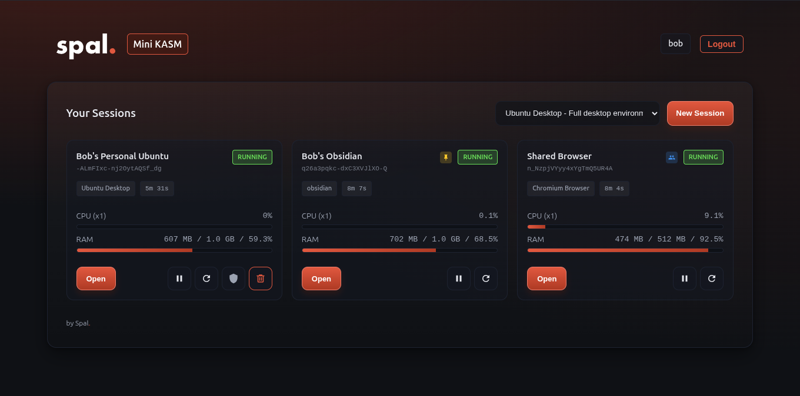

<a href="https://github.com/spaaleks/mini-kasm/releases">
  
</a>
<a href="https://hub.docker.com/r/spaleks/mini-kasm">
  
</a>

# Mini KASM

A lightweight, self-hosted desktop streaming platform. Create on-demand browser or desktop sessions with per-user resource limits, fixed instances, and shared workspaces.

Supports any [KASM Workspaces image](https://hub.docker.com/u/kasmweb) like Chromium, Firefox, Chrome, or full desktops.

---

## Features

- Simple login UI with bcrypt password verification
- YAML-configured users with per-user resource limits
- Fixed instances (always available, per-user)
- Shared instances (multi-user with admin controls)
- Idle sessions auto-pause, resume on login
- Container capability controls (cap_add, cap_drop per image)
- WebSocket-capable reverse proxy for KASM noVNC client

---

## Docker Compose

```yaml
services:
  mini-kasm:
    image: spaleks/mini-kasm:latest
    container_name: mini-kasm
    environment:
      - CONFIG_PATH=/config/users.yaml
      - DOCKER_HOST=unix:///var/run/docker.sock
      - PORT=32090
    volumes:
      - ./config:/config:ro
      - /var/run/docker.sock:/var/run/docker.sock
    networks:
      - spal_kasm_net
    ports:
      - "32090:32090"

networks:
  spal_kasm_net:
    name: spal_kasm_net
    external: true
```

Create the network before starting: `docker network create spal_kasm_net`

---

## Configuration

Edit `config/users.yaml`:

```yaml
server:
  secret_key: "change-me-to-a-secure-random-string"
  session_path_prefix: "/u"
  idle_timeout_seconds: 600
  max_sessions_total: 50
  login_session_timeout_hours: 24

docker:
  network: "spal_kasm_net"
  container_port: 6901
  shm_size: "512m"
  allowed_images:
    chromium:
      name: "Chromium Browser"
      image: "kasmweb/chromium:1.16.1"
      default: true
    obsidian:
      name: "Obsidian"
      image: "kasmweb/obsidian:1.18.0"
      volumes:
        - path: "/home/kasm-user/obsidian"
          suffix: "obsidian-vaults"
    desktop:
      name: "Ubuntu Desktop"
      image: "kasmweb/ubuntu-jammy-desktop:1.16.1"
      cap_add: [CHOWN, SETUID, SETGID, NET_RAW, SYS_CHROOT]

users:
  - username: "alice"
    password_hash_bcrypt: "$2b$12$..."
    max_sessions: 2
    cpu_limit: 1.0
    mem_limit: "1536m"
    persistent_volume: true

fixed_instances:
  - id: "alice-desktop"
    name: "My Desktop"
    username: "alice"
    image: "desktop"
    protected: true

shared_instances:
  - id: "team-browser"
    name: "Team Browser"
    image: "chromium"
    allowed_users: [alice, bob]
    admin_users: [alice]
```

### Generating Password Hashes

```bash
python3 -c "import bcrypt; print(bcrypt.hashpw(b'yourpassword', bcrypt.gensalt()).decode())"
```

Or use [it-tools.tech/bcrypt](https://it-tools.tech/bcrypt) ([GitHub](https://github.com/CorentinTh/it-tools)).

### Available KASM Images

- `kasmweb/chromium` - Chromium browser
- `kasmweb/firefox` - Firefox browser
- `kasmweb/chrome` - Google Chrome
- `kasmweb/desktop` - Full Ubuntu desktop

See [hub.docker.com/u/kasmweb](https://hub.docker.com/u/kasmweb) for more options.

---

## Production with Caddy

```
apps.example.com {
  reverse_proxy mini-kasm:32090
}
```

---

## Local Development

```bash
git clone https://github.com/spaaleks/mini-kasm.git
cd mini-kasm
./bin/start.sh
```

Access via [http://localhost:32090](http://localhost:32090)

On Linux, you can also run natively with `./bin/start-native.sh`

---

## License

MIT
